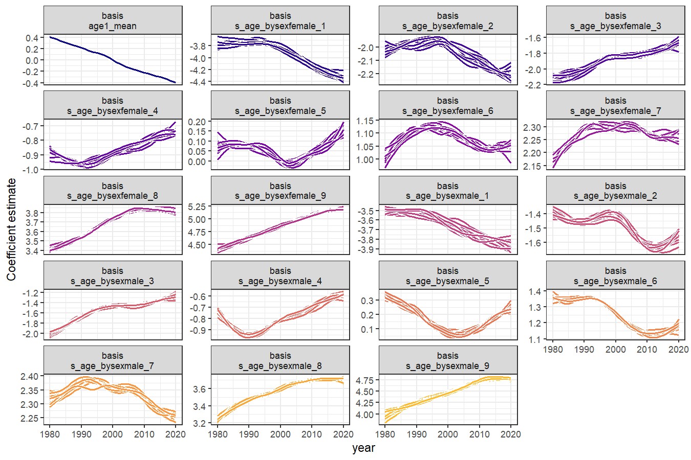
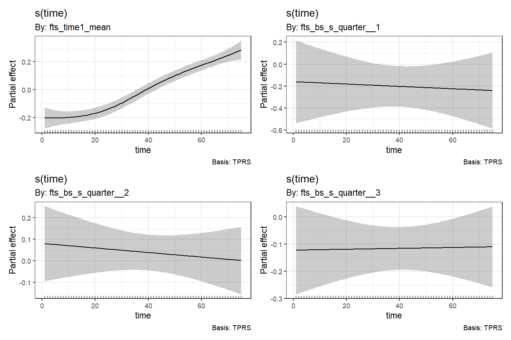

<!-- README.md is generated from README.Rmd. Please edit that file -->

# ffc

<!-- badges: start -->

[](https://lifecycle.r-lib.org/articles/stages.html#experimental)
[](https://CRAN.R-project.org/package=ffc)
[](https://github.com/nicholasjclark/ffc/actions/workflows/R-CMD-check.yaml)
[](https://app.codecov.io/gh/nicholasjclark/ffc)
<!-- badges: end -->

# ffc

> **F**unctional **F**ore**C**asting

The goal of the `ffc` 📦 is to perform functional regression using
Generalized Additive Models (GAMs). The package integrates with the
extremely flexible <a href="https://cran.r-project.org/package=mgcv"
target="_blank"><code>mgcv</code></a> package to enable functional
responses to be modelled and predicted using a broad range of predictor
effects. Key among these types of predictors are *dynamic functional
predictors* using a new `fts()` term, which sets up functional
predictors whose coefficients are modelled as time-varying. These
time-varying coefficients can then be forecasted ahead using a variety
of efficient forecasting algorithms, providing unmatched flexibility to
model and predict how functional responses change over time.

## Installation

You can install the development version of ffc from
[GitHub](https://github.com/) with:

``` r
# install.packages("pak")
pak::pak("nicholasjclark/ffc")
```

## A brief example

Load the in-built Queensland Mortality data, which contains the number
of deaths per age category over time in the state of Queensland,
Australia

``` r
library(ffc)
library(ggplot2)
theme_set(theme_bw())
data("qld_mortality")
head(qld_mortality, 15)
#>    year age    sex deaths population
#> 1  1980   0 female    190   17699.81
#> 2  1980   1 female     20   17505.27
#> 3  1980   2 female      6   17715.56
#> 4  1980   3 female      6   18080.06
#> 5  1980   4 female     10   18390.10
#> 6  1980   5 female      6   18870.54
#> 7  1980   6 female      1   19641.01
#> 8  1980   7 female      2   20475.01
#> 9  1980   8 female      2   21599.01
#> 10 1980   9 female      7   22170.09
#> 11 1980  10 female      2   21750.01
#> 12 1980  11 female      3   20866.51
#> 13 1980  12 female      1   20384.50
#> 14 1980  13 female      8   19848.04
#> 15 1980  14 female     11   19505.02
```

Visualise the observed mortality curves over time using the log10 scale

``` r
ggplot(
  data = qld_mortality,
  aes(
    x = age,
    y = deaths / population,
    group = year,
    colour = year
  )
) +
  geom_line() +
  facet_wrap(~sex) +
  scale_colour_viridis_c() +
  labs(y = "Observed log(Mortality)") +
  scale_y_log10()
```


Fit a model to estimate how the log(mortality) curve changed over time
using `deaths` as the outcome and using a time-varying function of `age`
as the primary predictor. Using `fts()`, we model the age-death
functions hierarchically using thin plate basis functions whose
coefficients are allowed to vary over time, where `time = 'year'`. The
hierarchical formulation allows a shared time-varying level to be
modelled, along with deviations around that time-varying level for each
sex. We use the `bam()` engine (as opposed to `gam()`) for parameter
estimation, given the large size of the dataset. In future, other
engines such as `brm()` and `mvgam()`, will be made available for full
luxury Bayesian inference.

``` r
mod <- ffc_gam(
  deaths ~
    offset(log(population)) +
    sex +
    # Use mean_only = TRUE to model a time-varying level
    fts(
      year,
      mean_only = TRUE,
      bs = 'tp',
      time_k = 35
    ) +
    # Model the male/female deviations around the shared mean
    fts(
      age,
      by = sex,
      bs = 'tp',
      time_k = 15
    ),
  time = "year",
  data = qld_mortality,
  family = poisson(),
  engine = "bam"
)
```

Inspect the model summary; notice in the `Formula` slot how the basis
functions are modelled as `by` variables within independent smooths of
`year` that share their smoothing parameters

``` r
summary(mod)
#> 
#> Family: poisson 
#> Link function: log 
#> 
#> Formula:
#> deaths ~ sex + offset(log(population)) + s(year, by = fts_year1_mean, 
#>     bs = "tp", k = 35, m = 2, id = 1) + s(year, by = fts_bs_s_age_bysexfemale_1, 
#>     bs = "tp", k = 15, m = 2, id = 2) + s(year, by = fts_bs_s_age_bysexfemale_2, 
#>     bs = "tp", k = 15, m = 2, id = 2) + s(year, by = fts_bs_s_age_bysexfemale_3, 
#>     bs = "tp", k = 15, m = 2, id = 2) + s(year, by = fts_bs_s_age_bysexfemale_4, 
#>     bs = "tp", k = 15, m = 2, id = 2) + s(year, by = fts_bs_s_age_bysexfemale_5, 
#>     bs = "tp", k = 15, m = 2, id = 2) + s(year, by = fts_bs_s_age_bysexfemale_6, 
#>     bs = "tp", k = 15, m = 2, id = 2) + s(year, by = fts_bs_s_age_bysexfemale_7, 
#>     bs = "tp", k = 15, m = 2, id = 2) + s(year, by = fts_bs_s_age_bysexfemale_8, 
#>     bs = "tp", k = 15, m = 2, id = 2) + s(year, by = fts_bs_s_age_bysexfemale_9, 
#>     bs = "tp", k = 15, m = 2, id = 2) + s(year, by = fts_bs_s_age_bysexmale_1, 
#>     bs = "tp", k = 15, m = 2, id = 2) + s(year, by = fts_bs_s_age_bysexmale_2, 
#>     bs = "tp", k = 15, m = 2, id = 2) + s(year, by = fts_bs_s_age_bysexmale_3, 
#>     bs = "tp", k = 15, m = 2, id = 2) + s(year, by = fts_bs_s_age_bysexmale_4, 
#>     bs = "tp", k = 15, m = 2, id = 2) + s(year, by = fts_bs_s_age_bysexmale_5, 
#>     bs = "tp", k = 15, m = 2, id = 2) + s(year, by = fts_bs_s_age_bysexmale_6, 
#>     bs = "tp", k = 15, m = 2, id = 2) + s(year, by = fts_bs_s_age_bysexmale_7, 
#>     bs = "tp", k = 15, m = 2, id = 2) + s(year, by = fts_bs_s_age_bysexmale_8, 
#>     bs = "tp", k = 15, m = 2, id = 2) + s(year, by = fts_bs_s_age_bysexmale_9, 
#>     bs = "tp", k = 15, m = 2, id = 2)
#> 
#> Parametric coefficients:
#>              Estimate Std. Error z value Pr(>|z|)    
#> (Intercept) -5.650741   0.004071 -1387.9   <2e-16 ***
#> sexmale      0.576371   0.005016   114.9   <2e-16 ***
#> ---
#> Signif. codes:  0 '***' 0.001 '**' 0.01 '*' 0.05 '.' 0.1 ' ' 1
#> 
#> Approximate significance of smooth terms:
#>                                       edf Ref.df Chi.sq p-value    
#> s(year):fts_year1_mean             31.761 33.633  10202  <2e-16 ***
#> s(year):fts_bs_s_age_bysexfemale_1  7.048  8.198  16336  <2e-16 ***
#> s(year):fts_bs_s_age_bysexfemale_2  5.291  6.233  10286  <2e-16 ***
#> s(year):fts_bs_s_age_bysexfemale_3  6.749  7.794   9625  <2e-16 ***
#> s(year):fts_bs_s_age_bysexfemale_4  5.349  6.314   8522  <2e-16 ***
#> s(year):fts_bs_s_age_bysexfemale_5  6.476  7.476   8479  <2e-16 ***
#> s(year):fts_bs_s_age_bysexfemale_6  5.205  6.146   8713  <2e-16 ***
#> s(year):fts_bs_s_age_bysexfemale_7  6.379  7.370   7815  <2e-16 ***
#> s(year):fts_bs_s_age_bysexfemale_8  5.108  5.942  11491  <2e-16 ***
#> s(year):fts_bs_s_age_bysexfemale_9  5.549  6.283   6097  <2e-16 ***
#> s(year):fts_bs_s_age_bysexmale_1    7.425  8.630  19621  <2e-16 ***
#> s(year):fts_bs_s_age_bysexmale_2    5.780  6.825  11220  <2e-16 ***
#> s(year):fts_bs_s_age_bysexmale_3    7.129  8.282  12804  <2e-16 ***
#> s(year):fts_bs_s_age_bysexmale_4    5.755  6.825  11978  <2e-16 ***
#> s(year):fts_bs_s_age_bysexmale_5    6.755  7.867  14718  <2e-16 ***
#> s(year):fts_bs_s_age_bysexmale_6    5.407  6.416  12071  <2e-16 ***
#> s(year):fts_bs_s_age_bysexmale_7    6.474  7.528  11899  <2e-16 ***
#> s(year):fts_bs_s_age_bysexmale_8    5.218  6.068  13555  <2e-16 ***
#> s(year):fts_bs_s_age_bysexmale_9    5.373  6.074   6747  <2e-16 ***
#> ---
#> Signif. codes:  0 '***' 0.001 '**' 0.01 '*' 0.05 '.' 0.1 ' ' 1
#> 
#> R-sq.(adj) =  0.986   Deviance explained = 97.6%
#> fREML =  21791  Scale est. = 1         n = 8282
```

View predicted functional curves using a fixed offset (where
`population = 1`), which allows us to calculate a standardized rate of
mortality

``` r
newdat <- qld_mortality
newdat$population <- 1
newdat$preds <- predict(
  mod,
  newdata = newdat,
  type = "response"
)

ggplot(
  data = newdat,
  aes(
    x = age,
    y = preds,
    group = year,
    colour = year
  )
) +
  geom_line() +
  facet_wrap(~sex) +
  scale_colour_viridis_c() +
  labs(y = "Expected log10(Mortality)") +
  scale_y_log10()
```


Using support from the `marginaleffects` 📦, we can make easily predict
changes in mortality rate for specific age groups. For example, here is
the expected decline in mortality rate for 17 year-olds in Queensland
over the study period

``` r
library(marginaleffects)
plot_predictions(
  mod,
  by = c("year", "sex"),
  newdata = datagrid(
    age = 17,
    year = unique,
    sex = unique,
    population = 1
  ),
  type = "response"
) +
  labs(
    x = "Year",
    y = "Expected log10(Mortality)"
  ) +
  scale_y_log10()
```


And here are the slopes of this change

``` r
plot_slopes(
  mod,
  variables = "year",
  by = c("year", "sex"),
  newdata = datagrid(
    age = 17,
    year = unique,
    sex = unique,
    population = 1
  ),
  type = "response"
) +
  labs(
    x = "Year",
    y = "1st derivative of mortality rate change"
  ) +
  geom_hline(
    yintercept = 0,
    linetype = "dashed"
  )
```


The time-varying coefficients can be extracted into a `tidy` format
using `fts_coefs()`, which will facilitate the use of time series models
to enable efficient forecasting of the entire curve into the future.
Using `summary = FALSE` will return draws of each coefficient time
series from the model’s empirical Bayesian posterior distribution (you
can control the number of draws that are returned using the `times`
argument):

``` r
functional_coefs <- fts_coefs(
  mod,
  summary = FALSE,
  times = 10
)
functional_coefs
#> # A tibble: 7,790 × 5
#>    .basis         .time .estimate .realisation  year
#>    <chr>          <int>     <dbl>        <int> <int>
#>  1 fts_year1_mean  1980     0.386            1  1980
#>  2 fts_year1_mean  1981     0.379            1  1981
#>  3 fts_year1_mean  1982     0.419            1  1982
#>  4 fts_year1_mean  1983     0.325            1  1983
#>  5 fts_year1_mean  1984     0.318            1  1984
#>  6 fts_year1_mean  1985     0.331            1  1985
#>  7 fts_year1_mean  1986     0.280            1  1986
#>  8 fts_year1_mean  1987     0.257            1  1987
#>  9 fts_year1_mean  1988     0.247            1  1988
#> 10 fts_year1_mean  1989     0.264            1  1989
#> # ℹ 7,780 more rows
```

The basis function coefficient time series can be plotted using
`autoplot()`

``` r
autoplot(functional_coefs)
```



Clearly there is a lot of structure and dependence here, suggesting that
a dynamic factor model fitted to these coefficient time series would be
valuable for creating functional forecasts. But for now we can apply any
model from the `fable` 📦 to these replicate time series and generate
future forecast realisations, which can be summarised to approximate the
full uncertainty in our coefficient forecast distributions. Again here
you can control the number of forecast paths that are simulated from the
underlying time series models using the `times` argument

``` r
functional_fc <- forecast(
  object = functional_coefs,
  h = 5,
  times = 5
)
#> Registered S3 method overwritten by 'tsibble':
#>   method               from 
#>   as_tibble.grouped_df dplyr
functional_fc
#> # A tsibble: 4,750 x 6 [1Y]
#> # Key:       .basis, .realisation, .model, .rep [950]
#>    .basis                     .realisation .model .time .rep   .sim
#>    <chr>                             <int> <chr>  <dbl> <chr> <dbl>
#>  1 fts_bs_s_age_bysexfemale_1            1 ARIMA   2021 1      4.85
#>  2 fts_bs_s_age_bysexfemale_1            1 ARIMA   2022 1      4.85
#>  3 fts_bs_s_age_bysexfemale_1            1 ARIMA   2023 1      4.86
#>  4 fts_bs_s_age_bysexfemale_1            1 ARIMA   2024 1      4.87
#>  5 fts_bs_s_age_bysexfemale_1            1 ARIMA   2025 1      4.89
#>  6 fts_bs_s_age_bysexfemale_1            1 ARIMA   2021 2      4.85
#>  7 fts_bs_s_age_bysexfemale_1            1 ARIMA   2022 2      4.84
#>  8 fts_bs_s_age_bysexfemale_1            1 ARIMA   2023 2      4.82
#>  9 fts_bs_s_age_bysexfemale_1            1 ARIMA   2024 2      4.78
#> 10 fts_bs_s_age_bysexfemale_1            1 ARIMA   2025 2      4.72
#> # ℹ 4,740 more rows
```

Another example showing univariate time series modelling and forecasting

``` r
library(fable)
library(tsibble)
library(dplyr)
```

Our aim here is to forecast the number of domestic holiday travellers to
Melbourne, Australia. The data can be found in the `tsibble::tourism`
data set. For now we need to explicitly add the `quarter` and `time`
variables to the data, but in future this will be done automatically for
seamless integration with the `tsibbleverse`

``` r
tourism_melb <- tourism %>%
  filter(Region == "Melbourne",
         Purpose == "Holiday") %>%
  mutate(quarter = lubridate::quarter(Quarter),
         time = dplyr::row_number())
tourism_melb
#> # A tsibble: 80 x 7 [1Q]
#> # Key:       Region, State, Purpose [1]
#>    Quarter Region    State    Purpose Trips quarter  time
#>      <qtr> <chr>     <chr>    <chr>   <dbl>   <int> <int>
#>  1 1998 Q1 Melbourne Victoria Holiday  428.       1     1
#>  2 1998 Q2 Melbourne Victoria Holiday  424.       2     2
#>  3 1998 Q3 Melbourne Victoria Holiday  450.       3     3
#>  4 1998 Q4 Melbourne Victoria Holiday  451.       4     4
#>  5 1999 Q1 Melbourne Victoria Holiday  412.       1     5
#>  6 1999 Q2 Melbourne Victoria Holiday  355.       2     6
#>  7 1999 Q3 Melbourne Victoria Holiday  362.       3     7
#>  8 1999 Q4 Melbourne Victoria Holiday  342.       4     8
#>  9 2000 Q1 Melbourne Victoria Holiday  434.       1     9
#> 10 2000 Q2 Melbourne Victoria Holiday  403.       2    10
#> # ℹ 70 more rows
```

Split into training and testing folds. We wil aim to forecast the last 5
quarters of the data

``` r
train <- tourism_melb %>%
  dplyr::slice_head(n = 75)

test <- tourism_melb %>%
  dplyr::slice_tail(n = 5)
```

Now fit an `ffc` model. We use time-varying level and time-varying
seasonality components, together with a Tweedie observation model
(because our outcome, `Trips`, consists of non-negative real values).
This model is simpler so we use the `'gam'` engine for fitting:

``` r
mod <- ffc_gam(
  Trips ~
    # Use mean_only = TRUE to model a time-varying mean
    fts(
      time,
      mean_only = TRUE,
      time_k = 50
    ) +
    # Time-varying seasonality
    fts(
      quarter,
      bs = 'tp',
      k = 4,
      time_k = 15
    ),
  time = "time",
  data = train,
  family = tw(),
  engine = 'gam'
)
```

Draw the time-varying basis coefficients, this time using `gratia`

``` r
gratia::draw(mod)
```



Compute forecast distribution by fitting the basis coefficient time
series models in parallel (which is automatically supported within the
`fable` package). Here we fit independent exponential smoothing models
to each coefficient time series

``` r
fc <- forecast(
  object = mod,
  newdata = test,
  model = 'ETS',
  summary = FALSE
)
```

Convert resulting forecasts to a `fable` object for automatic plotting
and/or scoring of forecasts

``` r
test[['value']] <- fc

fc_ffc <- fabletools:::build_fable(
  test,
  response = 'Trips',
  distribution = 'value'
)
```

Plot the forecast distribution along with the observed data

``` r
fc_ffc %>%
  autoplot(train) +
  geom_line(
    data = test,
    aes(y = Trips)
  ) +
  ggtitle('FFC forecast')
```


Compare to forecasts from automatic ARIMA and ETS models, which are
simpler to code and of course a bit faster

``` r
train %>%
  model(
    arima = ARIMA(Trips)) %>%
  forecast(
    h = 5
  ) %>%
  autoplot(train) +
  geom_line(
    data = test,
    aes(y = Trips)
  ) +
  ggtitle('ARIMA forecast')
```


``` r
train %>%
  model(
    ets = ETS(Trips)) %>%
  forecast(
    h = 5
  ) %>%
  autoplot(train) +
  geom_line(
    data = test,
    aes(y = Trips)
  ) +
  ggtitle('ETS forecast')
```


## Getting help

If you encounter a clear bug, please file an issue with a minimal
reproducible example on
[GitHub](https://github.com/nicholasjclark/ffc/issues)

## Contributing

Contributions are very welcome, but please see our [Code of
Conduct](https://github.com/nicholasjclark/ffc/blob/main/.github/CODE_OF_CONDUCT.md)
when you are considering changes that you would like to make.

## License

The `ffc` project is licensed under an `MIT` open source license
