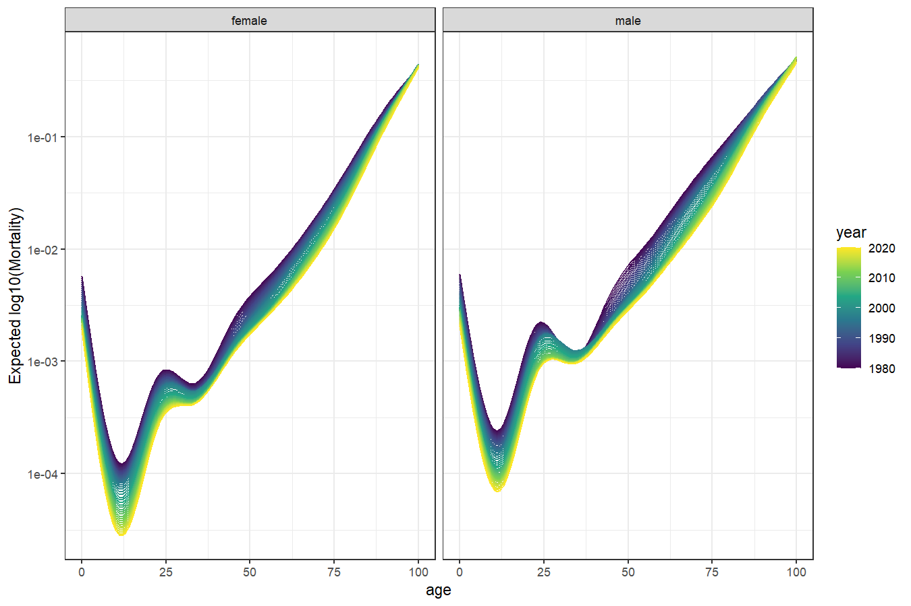
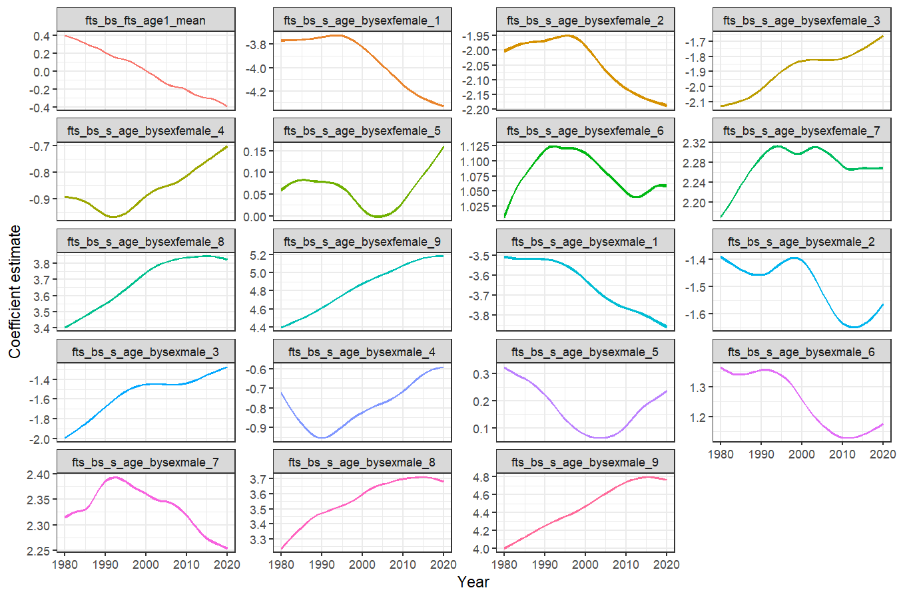

<!-- README.md is generated from README.Rmd. Please edit that file -->

# ffc

<!-- badges: start -->

[](https://lifecycle.r-lib.org/articles/stages.html#experimental)
[](https://CRAN.R-project.org/package=ffc)
[](https://github.com/nicholasjclark/ffc/actions/workflows/R-CMD-check.yaml)
[](https://app.codecov.io/gh/nicholasjclark/ffc)
<!-- badges: end -->

# ffc

> **F**unctional **F**ore**C**asting

The goal of the `ffc` 📦 is to perform functional regression using
Generalized Additive Models (GAMs). The package integrates with the
extremely flexible <a href="https://cran.r-project.org/package=mgcv"
target="_blank"><code>mgcv</code></a> package to enable functional
responses to be modelled and predicted using a broad range of predictor
effects. Key among these types of predictors are *dynamic functional
predictors* using a new `fts()` term, which sets up functional
predictors whose coefficients are modelled as time-varying. These
time-varying coefficients can then be forecasted ahead using a variety
of efficient forecasting algorithms, providing unmatched flexibility to
model and predict how functional responses change over time.

## Installation

You can install the development version of ffc from
[GitHub](https://github.com/) with:

``` r
# install.packages("pak")
pak::pak("nicholasjclark/ffc")
```

## A brief example

Load the in-built Queensland Mortality data, which contains the number
of deaths per age category over time in the state of Queensland,
Australia

``` r
library(ffc)
library(ggplot2); theme_set(theme_bw())
data('qld_mortality')
head(qld_mortality, 15)
#>    year age    sex deaths population
#> 1  1980   0 female    190   17699.81
#> 2  1980   1 female     20   17505.27
#> 3  1980   2 female      6   17715.56
#> 4  1980   3 female      6   18080.06
#> 5  1980   4 female     10   18390.10
#> 6  1980   5 female      6   18870.54
#> 7  1980   6 female      1   19641.01
#> 8  1980   7 female      2   20475.01
#> 9  1980   8 female      2   21599.01
#> 10 1980   9 female      7   22170.09
#> 11 1980  10 female      2   21750.01
#> 12 1980  11 female      3   20866.51
#> 13 1980  12 female      1   20384.50
#> 14 1980  13 female      8   19848.04
#> 15 1980  14 female     11   19505.02
```

Visualise the observed mortality curves over time using the log10 scale

``` r
ggplot(data = qld_mortality,
       aes(x = age,
           y = deaths / population,
           group = year,
           colour = year)) +
  geom_line() +
  facet_wrap(~ sex) +
  scale_colour_viridis_c() +
  labs(y = 'Observed log(Mortality)') +
  scale_y_log10()
```


Fit a model to estimate how the log(mortality) curve changed over time
using `deaths` as the outcome and using a time-varying function of `age`
as the primary predictor. Using `fts()`, we model the age-death function
with a set of `k = 10` thin plate basis functions whose coefficients are
allowed to vary over time, where `time = 'year'`. In this model we also
allow the time-varying effects to vary among sexes, while ensuring they
can be efficiently learned by linking their smoothing parameters. We use
the `bam()` engine (as opposed to `gam()`) for parameter estimation,
given the large size of the dataset. In future, other engines such as
`brm()` and `mvgam()`, will be made available for full luxury Bayesian
inference.

``` r
mod <- ffc_gam(
  deaths ~ 
    offset(log(population)) +
    sex + 
    fts(age, k = 10, bs = 'cr', by = sex,
        time_bs = 'cr', time_k = '15'),
  time = 'year',
  data = qld_mortality,
  family = poisson(),
  engine = 'bam'
)
```

Inspect the model summary; notice in the `Formula` slot how the basis
functions are modelled as `by` variables within independent smooths of
`year` that share their smoothing parameters

``` r
summary(mod)
#> 
#> Family: poisson 
#> Link function: log 
#> 
#> Formula:
#> deaths ~ sex + offset(log(population)) + s(year, by = fts_bs_s_age_bysexfemale_1, 
#>     bs = "cr", k = 15, id = 1) + s(year, by = fts_bs_s_age_bysexfemale_2, 
#>     bs = "cr", k = 15, id = 1) + s(year, by = fts_bs_s_age_bysexfemale_3, 
#>     bs = "cr", k = 15, id = 1) + s(year, by = fts_bs_s_age_bysexfemale_4, 
#>     bs = "cr", k = 15, id = 1) + s(year, by = fts_bs_s_age_bysexfemale_5, 
#>     bs = "cr", k = 15, id = 1) + s(year, by = fts_bs_s_age_bysexfemale_6, 
#>     bs = "cr", k = 15, id = 1) + s(year, by = fts_bs_s_age_bysexfemale_7, 
#>     bs = "cr", k = 15, id = 1) + s(year, by = fts_bs_s_age_bysexfemale_8, 
#>     bs = "cr", k = 15, id = 1) + s(year, by = fts_bs_s_age_bysexfemale_9, 
#>     bs = "cr", k = 15, id = 1) + s(year, by = fts_bs_s_age_bysexmale_1, 
#>     bs = "cr", k = 15, id = 1) + s(year, by = fts_bs_s_age_bysexmale_2, 
#>     bs = "cr", k = 15, id = 1) + s(year, by = fts_bs_s_age_bysexmale_3, 
#>     bs = "cr", k = 15, id = 1) + s(year, by = fts_bs_s_age_bysexmale_4, 
#>     bs = "cr", k = 15, id = 1) + s(year, by = fts_bs_s_age_bysexmale_5, 
#>     bs = "cr", k = 15, id = 1) + s(year, by = fts_bs_s_age_bysexmale_6, 
#>     bs = "cr", k = 15, id = 1) + s(year, by = fts_bs_s_age_bysexmale_7, 
#>     bs = "cr", k = 15, id = 1) + s(year, by = fts_bs_s_age_bysexmale_8, 
#>     bs = "cr", k = 15, id = 1) + s(year, by = fts_bs_s_age_bysexmale_9, 
#>     bs = "cr", k = 15, id = 1) + s(year, by = fts_bs_fts_age1_mean, 
#>     bs = "cr", k = 15, id = 1)
#> 
#> Parametric coefficients:
#>              Estimate Std. Error z value Pr(>|z|)    
#> (Intercept) -5.664580   0.004213 -1344.6   <2e-16 ***
#> sexmale      0.578047   0.005186   111.5   <2e-16 ***
#> ---
#> Signif. codes:  0 '***' 0.001 '**' 0.01 '*' 0.05 '.' 0.1 ' ' 1
#> 
#> Approximate significance of smooth terms:
#>                                       edf Ref.df   Chi.sq p-value    
#> s(year):fts_bs_s_age_bysexfemale_1  4.244  5.036  21201.5  <2e-16 ***
#> s(year):fts_bs_s_age_bysexfemale_2  4.870  5.812  18371.8  <2e-16 ***
#> s(year):fts_bs_s_age_bysexfemale_3  5.094  6.087  20280.6  <2e-16 ***
#> s(year):fts_bs_s_age_bysexfemale_4  5.823  6.979   8524.1  <2e-16 ***
#> s(year):fts_bs_s_age_bysexfemale_5  6.544  7.845    100.4  <2e-16 ***
#> s(year):fts_bs_s_age_bysexfemale_6  7.384  8.832  29241.5  <2e-16 ***
#> s(year):fts_bs_s_age_bysexfemale_7  8.190  9.752 163934.9  <2e-16 ***
#> s(year):fts_bs_s_age_bysexfemale_8  8.194  9.738 378514.7  <2e-16 ***
#> s(year):fts_bs_s_age_bysexfemale_9  5.892  7.064 319097.3  <2e-16 ***
#> s(year):fts_bs_s_age_bysexmale_1    4.590  5.463  34591.5  <2e-16 ***
#> s(year):fts_bs_s_age_bysexmale_2    5.712  6.843  23823.3  <2e-16 ***
#> s(year):fts_bs_s_age_bysexmale_3    5.798  6.948  26801.3  <2e-16 ***
#> s(year):fts_bs_s_age_bysexmale_4    6.443  7.726  11555.9  <2e-16 ***
#> s(year):fts_bs_s_age_bysexmale_5    7.256  8.686   1054.9  <2e-16 ***
#> s(year):fts_bs_s_age_bysexmale_6    8.104  9.656  58390.1  <2e-16 ***
#> s(year):fts_bs_s_age_bysexmale_7    8.509 10.104 232146.8  <2e-16 ***
#> s(year):fts_bs_s_age_bysexmale_8    7.814  9.315 394459.4  <2e-16 ***
#> s(year):fts_bs_s_age_bysexmale_9    4.889  5.840 125245.2  <2e-16 ***
#> s(year):fts_bs_fts_age1_mean       11.260 12.706   9557.7  <2e-16 ***
#> ---
#> Signif. codes:  0 '***' 0.001 '**' 0.01 '*' 0.05 '.' 0.1 ' ' 1
#> 
#> R-sq.(adj) =  0.987   Deviance explained = 97.7%
#> fREML =  20942  Scale est. = 1         n = 8282
```

View predicted functional curves using a fixed offset (where
`population = 1`), which allows us to calculate a standardized rate of
mortality

``` r
newdat <- qld_mortality
newdat$population <- 1
newdat$preds <- predict(
  mod,
  newdata = newdat,
  type = 'response'
)

ggplot(data = newdat,
       aes(x = age,
           y = preds,
           group = year,
           colour = year)) +
  geom_line() +
  facet_wrap(~ sex) +
  scale_colour_viridis_c() +
  labs(y = 'Expected log10(Mortality)') +
  scale_y_log10()
```



The time-varying coefficients (and their Standard Errors) can be
extracted into a `tidy` format using `fts_coefs()`, which will
facilitate the use of time series models to enable efficient forecasting
of the entire curve into the future

``` r
functional_coefs <- fts_coefs(mod)
functional_coefs
#> # A tibble: 779 × 5
#>    .basis                     .time .estimate     .se  year
#>    <chr>                      <int>     <dbl>   <dbl> <int>
#>  1 fts_bs_s_age_bysexfemale_1  1980     -3.77 0.00208  1980
#>  2 fts_bs_s_age_bysexfemale_1  1981     -3.77 0.00179  1981
#>  3 fts_bs_s_age_bysexfemale_1  1982     -3.77 0.00157  1982
#>  4 fts_bs_s_age_bysexfemale_1  1983     -3.77 0.00142  1983
#>  5 fts_bs_s_age_bysexfemale_1  1984     -3.76 0.00132  1984
#>  6 fts_bs_s_age_bysexfemale_1  1985     -3.76 0.00127  1985
#>  7 fts_bs_s_age_bysexfemale_1  1986     -3.76 0.00125  1986
#>  8 fts_bs_s_age_bysexfemale_1  1987     -3.75 0.00124  1987
#>  9 fts_bs_s_age_bysexfemale_1  1988     -3.75 0.00124  1988
#> 10 fts_bs_s_age_bysexfemale_1  1989     -3.74 0.00125  1989
#> # ℹ 769 more rows
```

There is no automatic plotting function yet to visualise these
time-varying coefficients, but for now we can use a bit of `ggplot` to
get this done

``` r
ggplot(
  data = functional_coefs,
  aes(x = year,
      y = .estimate,
      colour = .basis)
) +
  geom_ribbon(
    mapping = aes(ymax = .estimate + 2 * .se,
                  ymin = .estimate - 2 * .se,
                  fill = .basis),
    show.legend = FALSE
  ) +
  geom_line(
    show.legend = FALSE
  ) +
  facet_wrap(
    ~.basis, 
    scales = 'free_y',
    ncol = 4
  ) +
  labs(
    y = 'Coefficient estimate',
    x = 'Year'
  )
```



Clearly there is a lot of structure and dependence here, suggesting that
a dynamic factor model fitted to these coefficient time series would be
valuable for creating functional forecasts. More on that to come!

## Getting help

If you encounter a clear bug, please file an issue with a minimal
reproducible example on
[GitHub](https://github.com/nicholasjclark/ffc/issues)

## License

The `ffc` project is licensed under an `MIT` open source license
