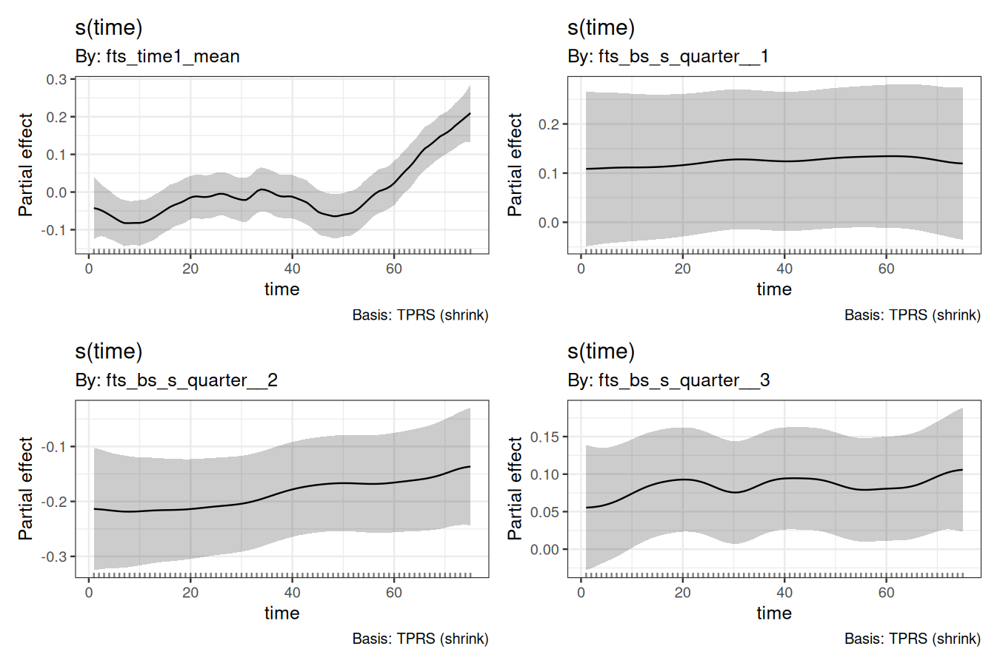
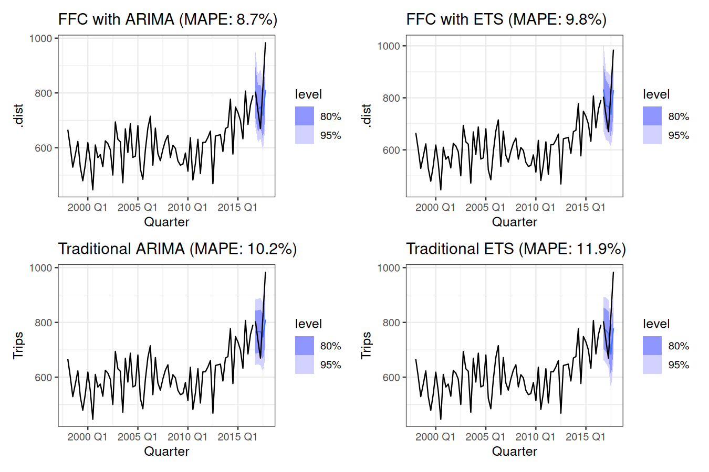

<!-- README.md is generated from README.Rmd. Please edit that file -->


# ffc

<!-- badges: start -->
[](https://lifecycle.r-lib.org/articles/stages.html#experimental)
[](https://CRAN.R-project.org/package=ffc)
[](https://github.com/nicholasjclark/ffc/actions/workflows/R-CMD-check.yaml)
[](https://app.codecov.io/gh/nicholasjclark/ffc)
<!-- badges: end -->

# ffc

> **F**unctional **F**ore**C**asting

The goal of the `ffc` 📦 is to **forecast complex, time-changing functional relationships** using Generalized Additive Models (GAMs). 

**Key benefits:**
- Model functional responses that change shape over time (not just magnitude)
- Forecast entire curves into the future, not just single values  
- Handle complex multivariate time series with functional structure
- Seamless integration with the powerful [`mgcv`](https://cran.r-project.org/package=mgcv) and [`fable`](https://fable.tidyverts.org/) ecosystems

The package introduces **dynamic functional predictors** using the new `fts()` term, which creates time-varying coefficients that can be forecasted using efficient Stan-based algorithms.

## Installation

You can install the development version of ffc from [GitHub](https://github.com/) with:

``` r
# install.packages("pak")
pak::pak("nicholasjclark/ffc")
```

## Quick Start


``` r
# Fit a model with time-varying coefficients
mod <- ffc_gam(
  response ~ fts(predictor, time_k = 10),  
  data = your_data,
  time = "time_column",
  family = gaussian()
)

# Forecast the functional coefficients
fc <- forecast(mod, newdata = future_data, model = "ARDF")
```

## Examples

### Queensland Mortality Analysis

The `ffc` package excels at modeling functional relationships that evolve over time. A detailed case study using Queensland mortality data demonstrates key concepts:


``` r
library(ffc)
library(ggplot2)
theme_set(theme_bw())
data("qld_mortality")
head(qld_mortality, 10)
#>    year age    sex deaths population
#> 1  1980   0 female    190   17699.81
#> 2  1980   1 female     20   17505.27
#> 3  1980   2 female      6   17715.56
#> 4  1980   3 female      6   18080.06
#> 5  1980   4 female     10   18390.10
#> 6  1980   5 female      6   18870.54
#> 7  1980   6 female      1   19641.01
#> 8  1980   7 female      2   20475.01
#> 9  1980   8 female      2   21599.01
#> 10 1980   9 female      7   22170.09
```


``` r
# Preview the functional patterns
ggplot(
  data = qld_mortality,
  aes(x = age, y = deaths / population, group = year, colour = year)
) +
  geom_line(alpha = 0.7) +
  facet_wrap(~sex) +
  scale_colour_viridis_c() +
  labs(y = "Mortality rate", title = "Evolving mortality patterns over time") +
  scale_y_log10()
```

<div class="figure">

<p class="caption">plot of chunk mortality-preview</p>
</div>

**Key features that make this ideal for functional forecasting:**
- **J-shaped mortality curves** that evolve smoothly over 40 years
- **Hierarchical structure** with sex-specific deviations from shared trends  
- **Systematic temporal patterns** suitable for time series forecasting

> **📖 For a comprehensive tutorial** covering model fitting, diagnostics, interpretation, and forecasting, see `vignette("mortality-analysis", package = "ffc")`

### Tourism Forecasting with fabletools Integration

``` r
library(fable)
library(tsibble)
library(dplyr)
```

Our aim here is to forecast the number of domestic visitors to Melbourne, Australia. The data can be found in the `tsibble::tourism` data set. For now we need to explicitly add the `quarter` and `time` variables to the data, but in future this will be done automatically for seamless integration with the `tsibbleverse`

``` r
tourism_melb <- tourism %>%
  filter(
    Region == "Melbourne",
    Purpose == "Visiting"
  ) %>%
  mutate(
    quarter = lubridate::quarter(Quarter),
    time = dplyr::row_number()
  )
tourism_melb
#> # A tsibble: 80 x 7 [1Q]
#> # Key:       Region, State, Purpose [1]
#>    Quarter Region    State    Purpose  Trips quarter  time
#>      <qtr> <chr>     <chr>    <chr>    <dbl>   <int> <int>
#>  1 1998 Q1 Melbourne Victoria Visiting  666.       1     1
#>  2 1998 Q2 Melbourne Victoria Visiting  601.       2     2
#>  3 1998 Q3 Melbourne Victoria Visiting  529.       3     3
#>  4 1998 Q4 Melbourne Victoria Visiting  575.       4     4
#>  5 1999 Q1 Melbourne Victoria Visiting  623.       1     5
#>  6 1999 Q2 Melbourne Victoria Visiting  530.       2     6
#>  7 1999 Q3 Melbourne Victoria Visiting  479.       3     7
#>  8 1999 Q4 Melbourne Victoria Visiting  538.       4     8
#>  9 2000 Q1 Melbourne Victoria Visiting  618.       1     9
#> 10 2000 Q2 Melbourne Victoria Visiting  549.       2    10
#> # ℹ 70 more rows
```

Split into training and testing folds. We wil aim to forecast the last 5 quarters of the data

``` r
train <- tourism_melb %>%
  dplyr::slice_head(n = 75)

test <- tourism_melb %>%
  dplyr::slice_tail(n = 5)
```

Now fit an `ffc_gam`. We use time-varying level and time-varying seasonality components, together with a Tweedie observation model (because our outcome, `Trips`, consists of non-negative real values). This model is simpler so we use the `'gam'` engine for fitting:

``` r
mod <- ffc_gam(
  Trips ~
    # Use mean_only = TRUE to model a time-varying mean
    fts(
      time,
      mean_only = TRUE,
      time_k = 50,
      time_m = 1
    ) +
    # Time-varying seasonality
    fts(
      quarter,
      k = 4,
      time_k = 15,
      time_m = 1
    ),
  time = "time",
  data = train,
  family = tw(),
  engine = "gam"
)
```

Draw the time-varying basis coefficients, this time using `gratia`

``` r
gratia::draw(mod)
```

<div class="figure">

<p class="caption">plot of chunk tourism-coefficients</p>
</div>

Compute forecast distribution by fitting the basis coefficient time series models in parallel (which is automatically supported within the `fable` package). Here we fit independent exponential smoothing models to each coefficient time series

``` r
fc <- forecast(
  object = mod,
  newdata = test,
  model = "ETS",
  summary = FALSE
)
```

Convert resulting forecasts to a `fable` object for automatic plotting and/or scoring of forecasts

``` r
# Using the new as_fable method for seamless conversion
fc_ffc <- as_fable(mod, newdata = test, forecasts = fc)
fc_ffc
#> # A fable: 5 x 10 [1Q]
#> # Key:     Region, State, Purpose [1]
#>   Quarter Region    State   Purpose Trips quarter  time       .dist .mean .model
#>     <qtr> <chr>     <chr>   <chr>   <dbl>   <int> <int>      <dist> <dbl> <chr> 
#> 1 2016 Q4 Melbourne Victor… Visiti…  804.       4    76 sample[200]  818. FFC_A…
#> 2 2017 Q1 Melbourne Victor… Visiti…  734.       1    77 sample[200]  759. FFC_A…
#> 3 2017 Q2 Melbourne Victor… Visiti…  670.       2    78 sample[200]  773. FFC_A…
#> 4 2017 Q3 Melbourne Victor… Visiti…  824.       3    79 sample[200]  755. FFC_A…
#> 5 2017 Q4 Melbourne Victor… Visiti…  985.       4    80 sample[200]  858. FFC_A…
```

Leverage the fabletools ecosystem for forecast analysis

``` r
# Calculate accuracy metrics
accuracy(fc_ffc, test)
#> # A tibble: 1 × 13
#>   .model    Region State Purpose .type    ME  RMSE   MAE   MPE  MAPE  MASE RMSSE
#>   <chr>     <chr>  <chr> <chr>   <chr> <dbl> <dbl> <dbl> <dbl> <dbl> <dbl> <dbl>
#> 1 FFC_ARIMA Melbo… Vict… Visiti… Test   10.9  80.6  67.7 0.154  8.37   NaN   NaN
#> # ℹ 1 more variable: ACF1 <dbl>

# Generate prediction intervals  
fc_intervals <- hilo(fc_ffc, level = c(80, 95))
fc_intervals
#> # A tsibble: 5 x 12 [1Q]
#> # Key:       Region, State, Purpose [1]
#>   Quarter Region    State   Purpose Trips quarter  time       .dist .mean .model
#>     <qtr> <chr>     <chr>   <chr>   <dbl>   <int> <int>      <dist> <dbl> <chr> 
#> 1 2016 Q4 Melbourne Victor… Visiti…  804.       4    76 sample[200]  818. FFC_A…
#> 2 2017 Q1 Melbourne Victor… Visiti…  734.       1    77 sample[200]  759. FFC_A…
#> 3 2017 Q2 Melbourne Victor… Visiti…  670.       2    78 sample[200]  773. FFC_A…
#> 4 2017 Q3 Melbourne Victor… Visiti…  824.       3    79 sample[200]  755. FFC_A…
#> 5 2017 Q4 Melbourne Victor… Visiti…  985.       4    80 sample[200]  858. FFC_A…
#> # ℹ 2 more variables: `80%` <hilo>, `95%` <hilo>

# Distribution summaries
fc_summary <- fc_ffc %>%
  summarise(
    mean_forecast = mean(.dist),
    median_forecast = median(.dist),
    q25 = quantile(.dist, 0.25), 
    q75 = quantile(.dist, 0.75)
  )
fc_summary
#> # A tsibble: 5 x 5 [1Q]
#>   Quarter mean_forecast median_forecast   q25   q75
#>     <qtr>         <dbl>           <dbl> <dbl> <dbl>
#> 1 2016 Q4          818.            822.  770.  869.
#> 2 2017 Q1          759.            752.  712.  803.
#> 3 2017 Q2          773.            773.  724.  822.
#> 4 2017 Q3          755.            758.  702.  797.
#> 5 2017 Q4          858.            865.  799.  907.
```

Compare FFC functional forecasting to traditional time series models

``` r
# Generate FFC forecasts with different models
fc_ffc_arima <- as_fable(mod, newdata = test, model = "ARIMA")
fc_ffc_ets <- as_fable(mod, newdata = test, model = "ETS")

# Generate traditional model forecasts
fc_traditional <- train %>%
  model(
    ARIMA = ARIMA(Trips),
    ETS = ETS(Trips)
  ) %>%
  forecast(h = 5)

# Calculate accuracy for all models
acc_ffc_arima <- accuracy(fc_ffc_arima, test)
acc_ffc_ets <- accuracy(fc_ffc_ets, test)
acc_traditional <- accuracy(fc_traditional, test)

# Extract MAPE values for titles
mape_ffc_arima <- round(acc_ffc_arima$MAPE, 1)
mape_ffc_ets <- round(acc_ffc_ets$MAPE, 1)
mape_arima <- round(acc_traditional$MAPE[acc_traditional$.model == "ARIMA"], 1)
mape_ets <- round(acc_traditional$MAPE[acc_traditional$.model == "ETS"], 1)

# Create comparison plots
library(patchwork)

p1 <- autoplot(fc_ffc_arima, train) + 
  geom_line(data = test, aes(y = Trips), color = "black") +
  ggtitle(paste0("FFC with ARIMA (MAPE: ", mape_ffc_arima, "%)"))

p2 <- autoplot(fc_ffc_ets, train) + 
  geom_line(data = test, aes(y = Trips), color = "black") +
  ggtitle(paste0("FFC with ETS (MAPE: ", mape_ffc_ets, "%)"))

p3 <- autoplot(filter(fc_traditional, .model == "ARIMA"), train) +
  geom_line(data = test, aes(y = Trips), color = "black") +
  ggtitle(paste0("Traditional ARIMA (MAPE: ", mape_arima, "%)"))

p4 <- autoplot(filter(fc_traditional, .model == "ETS"), train) +
  geom_line(data = test, aes(y = Trips), color = "black") +
  ggtitle(paste0("Traditional ETS (MAPE: ", mape_ets, "%)"))

(p1 | p2) / (p3 | p4)
```

<div class="figure">

<p class="caption">plot of chunk model-comparison</p>
</div>

``` r

# Display comprehensive accuracy comparison
rbind(acc_ffc_arima, acc_ffc_ets, acc_traditional)
#> # A tibble: 4 × 13
#>   .model    Region State Purpose .type    ME  RMSE   MAE   MPE  MAPE  MASE RMSSE
#>   <chr>     <chr>  <chr> <chr>   <chr> <dbl> <dbl> <dbl> <dbl> <dbl> <dbl> <dbl>
#> 1 FFC_ARIMA Melbo… Vict… Visiti… Test   38.5  93.6  68.5  3.59  8.03   NaN   NaN
#> 2 FFC_ETS   Melbo… Vict… Visiti… Test   20.9  83.7  67.0  1.43  8.16   NaN   NaN
#> 3 ARIMA     Melbo… Vict… Visiti… Test   32.4  98.6  84.3  2.62 10.2    NaN   NaN
#> 4 ETS       Melbo… Vict… Visiti… Test   48.9 120.   99.8  4.52 11.9    NaN   NaN
#> # ℹ 1 more variable: ACF1 <dbl>
```

## Getting help
If you encounter a clear bug, please file an issue with a minimal reproducible example on [GitHub](https://github.com/nicholasjclark/ffc/issues)

## Contributing
Contributions are very welcome, but please see our [Code of Conduct](https://github.com/nicholasjclark/ffc/blob/main/.github/CODE_OF_CONDUCT.md) when you are considering changes that you would like to make.

## License
The `ffc` project is licensed under an `MIT` open source license
