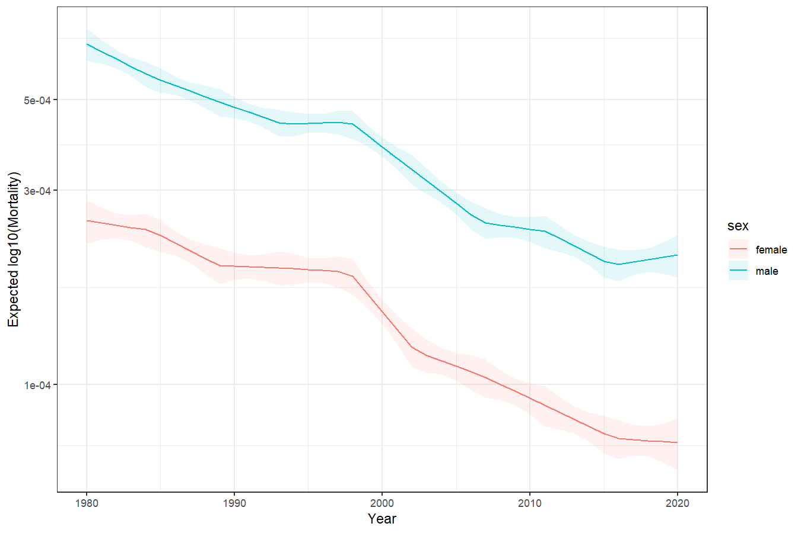
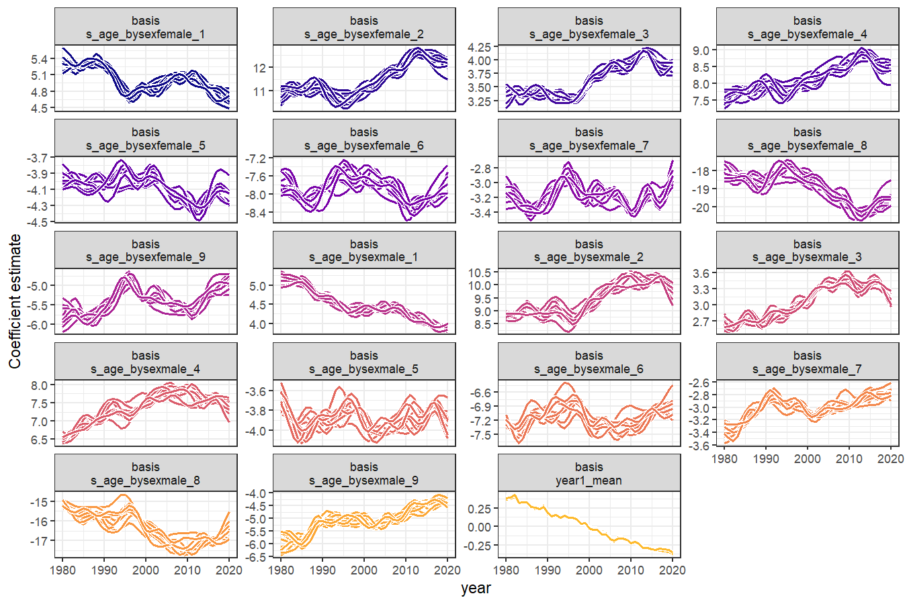
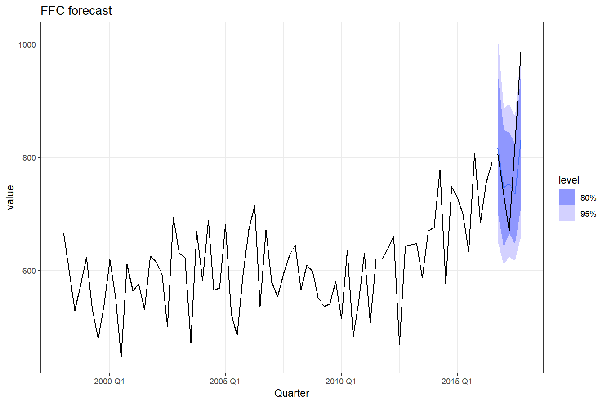
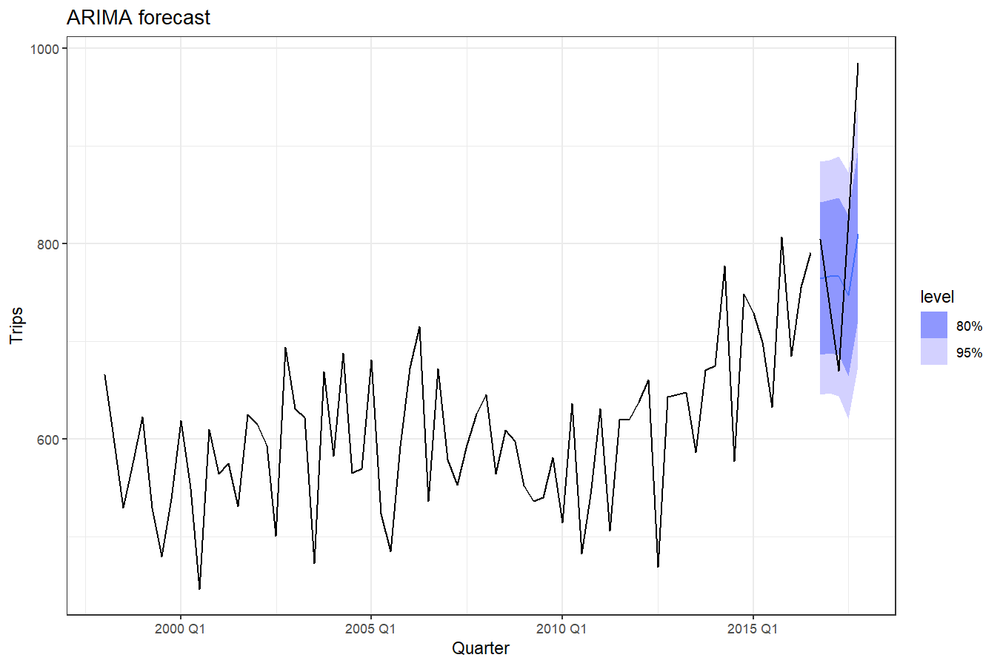

<!-- README.md is generated from README.Rmd. Please edit that file -->


# ffc

<!-- badges: start -->
[](https://lifecycle.r-lib.org/articles/stages.html#experimental)
[](https://CRAN.R-project.org/package=ffc)
[](https://github.com/nicholasjclark/ffc/actions/workflows/R-CMD-check.yaml)
[](https://app.codecov.io/gh/nicholasjclark/ffc)
<!-- badges: end -->

# ffc

> **F**unctional **F**ore**C**asting

The goal of the `ffc` 📦 is to **forecast complex, time-changing functional relationships** using Generalized Additive Models (GAMs). 

**Key benefits:**
- Model functional responses that change shape over time (not just magnitude)
- Forecast entire curves into the future, not just single values  
- Handle complex multivariate time series with functional structure
- Seamless integration with the powerful `mgcv` and `fable` ecosystems

The package introduces **dynamic functional predictors** using the new `fts()` term, which creates time-varying coefficients that can be forecasted using efficient Stan-based algorithms.

## Installation

You can install the development version of ffc from [GitHub](https://github.com/) with:

``` r
# install.packages("pak")
pak::pak("nicholasjclark/ffc")
```

## Quick Start


``` r
# Fit a model with time-varying coefficients
mod <- ffc_gam(
  response ~ fts(predictor, time_k = 10),  
  data = your_data,
  time = "time_column",
  family = gaussian()
)

# Forecast the functional coefficients
fc <- forecast(mod, newdata = future_data, model = "ARDF")
```

## Detailed Example: Queensland Mortality Data
Load the in-built Queensland Mortality data, which contains the number of deaths per age category over time in the state of Queensland, Australia.

``` r
library(ffc)
library(ggplot2)
theme_set(theme_bw())
data("qld_mortality")
head(qld_mortality, 15)
#>    year age    sex deaths population
#> 1  1980   0 female    190   17699.81
#> 2  1980   1 female     20   17505.27
#> 3  1980   2 female      6   17715.56
#> 4  1980   3 female      6   18080.06
#> 5  1980   4 female     10   18390.10
#> 6  1980   5 female      6   18870.54
#> 7  1980   6 female      1   19641.01
#> 8  1980   7 female      2   20475.01
#> 9  1980   8 female      2   21599.01
#> 10 1980   9 female      7   22170.09
#> 11 1980  10 female      2   21750.01
#> 12 1980  11 female      3   20866.51
#> 13 1980  12 female      1   20384.50
#> 14 1980  13 female      8   19848.04
#> 15 1980  14 female     11   19505.02
```

Visualise the observed mortality curves over time using the log10 scale

``` r
ggplot(
  data = qld_mortality,
  aes(
    x = age,
    y = deaths / population,
    group = year,
    colour = year
  )
) +
  geom_line() +
  facet_wrap(~sex) +
  scale_colour_viridis_c() +
  labs(y = "Observed log(Mortality)") +
  scale_y_log10()
```

<div class="figure">

<p class="caption">plot of chunk unnamed-chunk-4</p>
</div>

Fit a model to estimate how the log(mortality) curve changed over time using `deaths` as the outcome and using a time-varying function of `age` as the primary predictor. Using `fts()`, we model the age-death functions hierarchically using thin plate basis functions whose coefficients are allowed to vary over time, where `time = 'year'`. The hierarchical formulation allows a shared time-varying level to be modelled, along with deviations around that time-varying level for each sex. We use the `bam()` engine (as opposed to `gam()`) for parameter estimation, given the large size of the dataset. In future, other engines such as `brm()` and `mvgam()`, will be made available for full luxury Bayesian inference.

``` r
mod <- ffc_gam(
  deaths ~
    offset(log(population)) +
    sex +
    # Use mean_only = TRUE to model a time-varying level
    fts(
      year,
      mean_only = TRUE,
      bs = "tp",
      time_k = 35,
      time_m = 1
    ) +
    # Model the male/female deviations around the shared mean
    fts(
      age,
      by = sex,
      bs = "tp",
      time_k = 15,
      time_m = 1
    ),
  time = "year",
  data = qld_mortality,
  family = poisson(),
  engine = "bam"
)
```

Inspect the model summary; notice in the `Formula` slot how the basis functions are modelled as `by` variables within independent smooths of `year` that share their smoothing parameters

``` r
summary(mod)
#> 
#> Family: poisson 
#> Link function: log 
#> 
#> Formula:
#> deaths ~ sex + offset(log(population)) + s(year, by = fts_year1_mean, 
#>     bs = "ts", k = 35, m = 1, id = 1) + s(year, by = fts_bs_s_age_bysexfemale_1, 
#>     bs = "ts", k = 15, m = 1, id = 2) + s(year, by = fts_bs_s_age_bysexfemale_2, 
#>     bs = "ts", k = 15, m = 1, id = 2) + s(year, by = fts_bs_s_age_bysexfemale_3, 
#>     bs = "ts", k = 15, m = 1, id = 2) + s(year, by = fts_bs_s_age_bysexfemale_4, 
#>     bs = "ts", k = 15, m = 1, id = 2) + s(year, by = fts_bs_s_age_bysexfemale_5, 
#>     bs = "ts", k = 15, m = 1, id = 2) + s(year, by = fts_bs_s_age_bysexfemale_6, 
#>     bs = "ts", k = 15, m = 1, id = 2) + s(year, by = fts_bs_s_age_bysexfemale_7, 
#>     bs = "ts", k = 15, m = 1, id = 2) + s(year, by = fts_bs_s_age_bysexfemale_8, 
#>     bs = "ts", k = 15, m = 1, id = 2) + s(year, by = fts_bs_s_age_bysexfemale_9, 
#>     bs = "ts", k = 15, m = 1, id = 2) + s(year, by = fts_bs_s_age_bysexmale_1, 
#>     bs = "ts", k = 15, m = 1, id = 2) + s(year, by = fts_bs_s_age_bysexmale_2, 
#>     bs = "ts", k = 15, m = 1, id = 2) + s(year, by = fts_bs_s_age_bysexmale_3, 
#>     bs = "ts", k = 15, m = 1, id = 2) + s(year, by = fts_bs_s_age_bysexmale_4, 
#>     bs = "ts", k = 15, m = 1, id = 2) + s(year, by = fts_bs_s_age_bysexmale_5, 
#>     bs = "ts", k = 15, m = 1, id = 2) + s(year, by = fts_bs_s_age_bysexmale_6, 
#>     bs = "ts", k = 15, m = 1, id = 2) + s(year, by = fts_bs_s_age_bysexmale_7, 
#>     bs = "ts", k = 15, m = 1, id = 2) + s(year, by = fts_bs_s_age_bysexmale_8, 
#>     bs = "ts", k = 15, m = 1, id = 2) + s(year, by = fts_bs_s_age_bysexmale_9, 
#>     bs = "ts", k = 15, m = 1, id = 2)
#> 
#> Parametric coefficients:
#>              Estimate Std. Error z value Pr(>|z|)    
#> (Intercept) -5.648061   0.004039 -1398.2   <2e-16 ***
#> sexmale      0.574335   0.004986   115.2   <2e-16 ***
#> ---
#> Signif. codes:  0 '***' 0.001 '**' 0.01 '*' 0.05 '.' 0.1 ' ' 1
#> 
#> Approximate significance of smooth terms:
#>                                      edf Ref.df Chi.sq p-value    
#> s(year):fts_year1_mean             32.05     34  10342  <2e-16 ***
#> s(year):fts_bs_s_age_bysexfemale_1 14.50     15  16349  <2e-16 ***
#> s(year):fts_bs_s_age_bysexfemale_2 12.85     15  10267  <2e-16 ***
#> s(year):fts_bs_s_age_bysexfemale_3 14.49     15   9610  <2e-16 ***
#> s(year):fts_bs_s_age_bysexfemale_4 13.48     15   8470  <2e-16 ***
#> s(year):fts_bs_s_age_bysexfemale_5 14.41     15   8433  <2e-16 ***
#> s(year):fts_bs_s_age_bysexfemale_6 13.35     15   8667  <2e-16 ***
#> s(year):fts_bs_s_age_bysexfemale_7 14.35     15   7764  <2e-16 ***
#> s(year):fts_bs_s_age_bysexfemale_8 10.12     15  11476  <2e-16 ***
#> s(year):fts_bs_s_age_bysexfemale_9 13.05     15   6036  <2e-16 ***
#> s(year):fts_bs_s_age_bysexmale_1   14.44     15  19549  <2e-16 ***
#> s(year):fts_bs_s_age_bysexmale_2   12.95     15  11146  <2e-16 ***
#> s(year):fts_bs_s_age_bysexmale_3   14.64     15  12750  <2e-16 ***
#> s(year):fts_bs_s_age_bysexmale_4   13.75     15  11841  <2e-16 ***
#> s(year):fts_bs_s_age_bysexmale_5   14.56     15  14649  <2e-16 ***
#> s(year):fts_bs_s_age_bysexmale_6   13.74     15  12002  <2e-16 ***
#> s(year):fts_bs_s_age_bysexmale_7   14.52     15  11843  <2e-16 ***
#> s(year):fts_bs_s_age_bysexmale_8   10.19     15  13491  <2e-16 ***
#> s(year):fts_bs_s_age_bysexmale_9   12.44     15   6716  <2e-16 ***
#> ---
#> Signif. codes:  0 '***' 0.001 '**' 0.01 '*' 0.05 '.' 0.1 ' ' 1
#> 
#> R-sq.(adj) =  0.986   Deviance explained = 97.6%
#> fREML =  22189  Scale est. = 1         n = 8282
```

View predicted functional curves using a fixed offset (where `population = 1`), which allows us to calculate a standardized rate of mortality

``` r
newdat <- qld_mortality
newdat$population <- 1
newdat$preds <- predict(
  mod,
  newdata = newdat,
  type = "response"
)

ggplot(
  data = newdat,
  aes(
    x = age,
    y = preds,
    group = year,
    colour = year
  )
) +
  geom_line() +
  facet_wrap(~sex) +
  scale_colour_viridis_c() +
  labs(y = "Expected log10(Mortality)") +
  scale_y_log10()
```

<div class="figure">

<p class="caption">plot of chunk unnamed-chunk-7</p>
</div>

Using support from the `marginaleffects` 📦, we can make easily predict changes in mortality rate for specific age groups. For example, here is the expected decline in mortality rate for 17 year-olds in Queensland over the study period

``` r
library(marginaleffects)
plot_predictions(
  mod,
  by = c("year", "sex"),
  newdata = datagrid(
    age = 17,
    year = unique,
    sex = unique,
    population = 1
  ),
  type = "response"
) +
  labs(
    x = "Year",
    y = "Expected log10(Mortality)"
  ) +
  scale_y_log10()
```

<div class="figure">

<p class="caption">plot of chunk unnamed-chunk-8</p>
</div>

And here are the slopes of this change

``` r
plot_slopes(
  mod,
  variables = "year",
  by = c("year", "sex"),
  newdata = datagrid(
    age = 17,
    year = unique,
    sex = unique,
    population = 1
  ),
  type = "response"
) +
  labs(
    x = "Year",
    y = "1st derivative of mortality rate change"
  ) +
  geom_hline(
    yintercept = 0,
    linetype = "dashed"
  )
```

<div class="figure">

<p class="caption">plot of chunk unnamed-chunk-9</p>
</div>

**Key insights from this analysis:**
- The characteristic J-shaped mortality curves show systematic downward shifts over four decades
- Mortality rates for 17-year-olds dropped by approximately 70% (from ~6e-04 to ~2e-04) between 1980-2020
- The rate of mortality improvement varies over time, with periods of faster and slower decline
- The functional approach captures both overall level changes and subtle age-specific temporal patterns

This demonstrates how `ffc` captures evolving functional relationships that traditional time series models would miss.

The time-varying coefficients can be extracted into a `tidy` format using `fts_coefs()`, which will facilitate the use of time series models to enable efficient forecasting of the entire curve into the future. Using `summary = FALSE` will return draws of each coefficient time series from the model's empirical Bayesian posterior distribution (you can control the number of draws that are returned using the `times` argument):

``` r
functional_coefs <- fts_coefs(
  mod,
  summary = FALSE,
  times = 10
)
functional_coefs
#> # A tibble: 7,790 × 5
#>    .basis         .time .estimate .realisation  year
#>  * <chr>          <int>     <dbl>        <int> <int>
#>  1 fts_year1_mean  1980     0.374            1  1980
#>  2 fts_year1_mean  1981     0.378            1  1981
#>  3 fts_year1_mean  1982     0.398            1  1982
#>  4 fts_year1_mean  1983     0.298            1  1983
#>  5 fts_year1_mean  1984     0.318            1  1984
#>  6 fts_year1_mean  1985     0.326            1  1985
#>  7 fts_year1_mean  1986     0.263            1  1986
#>  8 fts_year1_mean  1987     0.259            1  1987
#>  9 fts_year1_mean  1988     0.240            1  1988
#> 10 fts_year1_mean  1989     0.252            1  1989
#> # ℹ 7,780 more rows
```

The basis function coefficient time series can be plotted using `autoplot()`

``` r
autoplot(functional_coefs)
```

<div class="figure">

<p class="caption">plot of chunk unnamed-chunk-11</p>
</div>

Clearly there is a lot of structure and dependence here, suggesting that a dynamic factor model fitted to these coefficient time series would be valuable for creating functional forecasts. But for now we can apply any model from the `fable` 📦 to these replicate time series and generate future forecast realisations, which can be summarised to approximate the full uncertainty in our coefficient forecast distributions. Again here you can control the number of forecast paths that are simulated from the underlying time series models using the `times` argument

``` r
functional_fc <- forecast(
  object = functional_coefs,
  h = 5,
  times = 5
)
functional_fc
#> # A tsibble: 4,750 x 6 [1Y]
#> # Key:       .basis, .realisation, .model, .rep [950]
#>    .basis                     .realisation .model .time .rep   .sim
#>    <chr>                             <int> <chr>  <dbl> <chr> <dbl>
#>  1 fts_bs_s_age_bysexfemale_1            1 ARIMA   2021 1      4.81
#>  2 fts_bs_s_age_bysexfemale_1            1 ARIMA   2022 1      4.90
#>  3 fts_bs_s_age_bysexfemale_1            1 ARIMA   2023 1      4.98
#>  4 fts_bs_s_age_bysexfemale_1            1 ARIMA   2024 1      5.06
#>  5 fts_bs_s_age_bysexfemale_1            1 ARIMA   2025 1      5.15
#>  6 fts_bs_s_age_bysexfemale_1            1 ARIMA   2021 2      4.81
#>  7 fts_bs_s_age_bysexfemale_1            1 ARIMA   2022 2      4.86
#>  8 fts_bs_s_age_bysexfemale_1            1 ARIMA   2023 2      4.94
#>  9 fts_bs_s_age_bysexfemale_1            1 ARIMA   2024 2      5.06
#> 10 fts_bs_s_age_bysexfemale_1            1 ARIMA   2025 2      5.12
#> # ℹ 4,740 more rows
```

Another example showing univariate time series modelling and forecasting

``` r
library(fable)
library(tsibble)
library(dplyr)
```

Our aim here is to forecast the number of domestic visitors to Melbourne, Australia. The data can be found in the `tsibble::tourism` data set. For now we need to explicitly add the `quarter` and `time` variables to the data, but in future this will be done automatically for seamless integration with the `tsibbleverse`

``` r
tourism_melb <- tourism %>%
  filter(
    Region == "Melbourne",
    Purpose == "Visiting"
  ) %>%
  mutate(
    quarter = lubridate::quarter(Quarter),
    time = dplyr::row_number()
  )
tourism_melb
#> # A tsibble: 80 x 7 [1Q]
#> # Key:       Region, State, Purpose [1]
#>    Quarter Region    State    Purpose  Trips quarter  time
#>      <qtr> <chr>     <chr>    <chr>    <dbl>   <int> <int>
#>  1 1998 Q1 Melbourne Victoria Visiting  666.       1     1
#>  2 1998 Q2 Melbourne Victoria Visiting  601.       2     2
#>  3 1998 Q3 Melbourne Victoria Visiting  529.       3     3
#>  4 1998 Q4 Melbourne Victoria Visiting  575.       4     4
#>  5 1999 Q1 Melbourne Victoria Visiting  623.       1     5
#>  6 1999 Q2 Melbourne Victoria Visiting  530.       2     6
#>  7 1999 Q3 Melbourne Victoria Visiting  479.       3     7
#>  8 1999 Q4 Melbourne Victoria Visiting  538.       4     8
#>  9 2000 Q1 Melbourne Victoria Visiting  618.       1     9
#> 10 2000 Q2 Melbourne Victoria Visiting  549.       2    10
#> # ℹ 70 more rows
```

Split into training and testing folds. We wil aim to forecast the last 5 quarters of the data

``` r
train <- tourism_melb %>%
  dplyr::slice_head(n = 75)

test <- tourism_melb %>%
  dplyr::slice_tail(n = 5)
```

Now fit an `ffc_gam`. We use time-varying level and time-varying seasonality components, together with a Tweedie observation model (because our outcome, `Trips`, consists of non-negative real values). This model is simpler so we use the `'gam'` engine for fitting:

``` r
mod <- ffc_gam(
  Trips ~
    # Use mean_only = TRUE to model a time-varying mean
    fts(
      time,
      mean_only = TRUE,
      time_k = 50,
      time_m = 1
    ) +
    # Time-varying seasonality
    fts(
      quarter,
      k = 4,
      time_k = 15,
      time_m = 1
    ),
  time = "time",
  data = train,
  family = tw(),
  engine = "gam"
)
```

Draw the time-varying basis coefficients, this time using `gratia`

``` r
gratia::draw(mod)
```

<div class="figure">

<p class="caption">plot of chunk unnamed-chunk-17</p>
</div>

Compute forecast distribution by fitting the basis coefficient time series models in parallel (which is automatically supported within the `fable` package). Here we fit independent exponential smoothing models to each coefficient time series

``` r
fc <- forecast(
  object = mod,
  newdata = test,
  model = "ETS",
  summary = FALSE
)
```

Convert resulting forecasts to a `fable` object for automatic plotting and/or scoring of forecasts

``` r
test[["value"]] <- fc

fc_ffc <- fabletools:::build_fable(
  test,
  response = "Trips",
  distribution = "value"
)
```

Plot the forecast distribution along with the observed data

``` r
fc_ffc %>%
  autoplot(train) +
  geom_line(
    data = test,
    aes(y = Trips)
  ) +
  ggtitle("FFC forecast")
```

<div class="figure">

<p class="caption">plot of chunk unnamed-chunk-20</p>
</div>

Compare to forecasts from automatic ARIMA and ETS models, which are simpler to code and of course a bit faster

``` r
train %>%
  model(
    arima = ARIMA(Trips)
  ) %>%
  forecast(
    h = 5
  ) %>%
  autoplot(train) +
  geom_line(
    data = test,
    aes(y = Trips)
  ) +
  ggtitle("ARIMA forecast")
```

<div class="figure">

<p class="caption">plot of chunk unnamed-chunk-21</p>
</div>


``` r
train %>%
  model(
    ets = ETS(Trips)
  ) %>%
  forecast(
    h = 5
  ) %>%
  autoplot(train) +
  geom_line(
    data = test,
    aes(y = Trips)
  ) +
  ggtitle("ETS forecast")
```

<div class="figure">

<p class="caption">plot of chunk unnamed-chunk-22</p>
</div>

## Getting help
If you encounter a clear bug, please file an issue with a minimal reproducible example on [GitHub](https://github.com/nicholasjclark/ffc/issues)

## Contributing
Contributions are very welcome, but please see our [Code of Conduct](https://github.com/nicholasjclark/ffc/blob/main/.github/CODE_OF_CONDUCT.md) when you are considering changes that you would like to make.

## License
The `ffc` project is licensed under an `MIT` open source license
