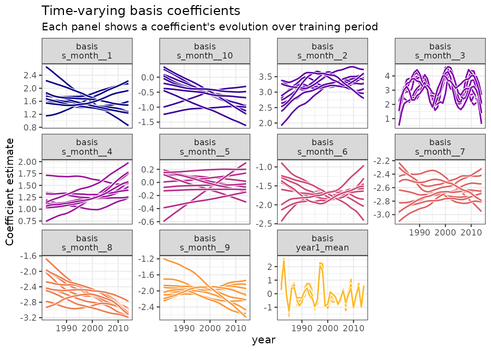
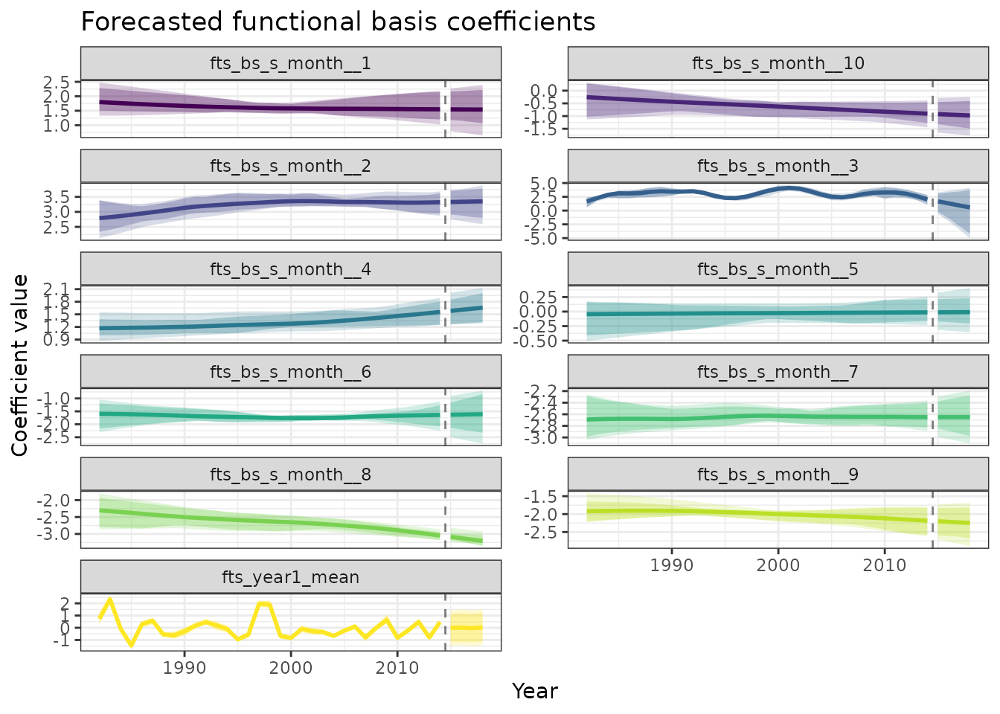

# Forecasting El Niño Patterns with Cyclic Splines and Dynamic Factor Models

``` r
library(ffc)
library(ggplot2)
library(dplyr)
library(marginaleffects)
library(fable)
library(tsibble)
theme_set(theme_bw())
```

## Introduction

Sea surface temperature (SST) in the tropical Pacific exhibits complex
seasonal patterns that evolve dramatically during El Niño-Southern
Oscillation (ENSO) events. Traditional time series methods often
struggle to capture both the cyclic seasonal structure and the
inter-annual variability that characterizes these ocean-atmosphere
interactions. This vignette demonstrates how functional forecasting with
the `ffc` package addresses these challenges through:

1.  Cyclic cubic splines that naturally handle periodic seasonal
    patterns  
2.  Gaussian Process Dynamic Factor (GPDF) models for sophisticated
    multivariate forecasting  
3.  Innovative validation techniques

### The forecasting challenge

El Niño SST data presents unique modeling challenges: - Strong seasonal
cycles that must connect smoothly at year boundaries  
- Inter-annual variability driven by complex ocean-atmosphere coupling -
Non-stationary patterns during ENSO transitions - Multiple correlated
time series of functional coefficients

### Our approach: functional coefficients meet dynamic factors

The `ffc` package treats seasonal patterns as smooth functions whose
shapes evolve over time. By combining GAM-based functional regression
with Stan-powered dynamic factor models, we can:  
- Preserve seasonal continuity while allowing flexible evolution  
- Capture shared trends across multiple coefficient series  
- Generate probabilistic forecasts with proper uncertainty
quantification  
- Validate predictions using state-of-the-art functional data metrics

## Data exploration

We’ll use monthly SST data from El Niño regions 1 and 2, spanning
1982-2018:

``` r
data("elnino_sst")
glimpse(elnino_sst)
#> Rows: 444
#> Columns: 3
#> Key: month [12]
#> $ year        <int> 1982, 1983, 1984, 1985, 1986, 1987, 1988, 1989, 1990, 1991…
#> $ month       <int> 1, 1, 1, 1, 1, 1, 1, 1, 1, 1, 1, 1, 1, 1, 1, 1, 1, 1, 1, 1…
#> $ temperature <dbl> 24.29, 27.42, 24.18, 23.59, 24.61, 25.30, 24.64, 24.09, 24…

# Check temporal coverage
cat("Years covered:", min(elnino_sst$year), "-", max(elnino_sst$year), "\n")
#> Years covered: 1982 - 2018
cat("Total observations:", nrow(elnino_sst), "\n")
#> Total observations: 444
cat("Monthly measurements per year:", elnino_sst |> 
    index_by(year) |> 
    summarise(n = n()) |> 
    pull(n) |> 
    unique(), "\n")
#> Monthly measurements per year: 12
```

### Visualizing seasonal patterns

``` r
ggplot(elnino_sst, aes(x = month, y = temperature, group = year, color = year)) +
  geom_line(alpha = 0.7, linewidth = 0.8) +
  scale_color_viridis_c(name = "Year") +
  scale_x_continuous(breaks = 1:12, labels = month.abb) +
  labs(
    x = "Month", 
    y = "Temperature (°C)",
    title = "El Niño SST: Evolving seasonal patterns",
    subtitle = "Each line represents one year's seasonal cycle"
  )
```


Monthly SST patterns across years. The seasonal cycle shows clear
evolution, with warmer years (red) during strong El Niño events like
1997-1998 and 2015-2016.

### Identifying ENSO events

Let’s examine annual means to identify major El Niño and La Niña events:

``` r
annual_means <- elnino_sst |>
  index_by(year) |>
  summarise(
    mean_temp = mean(temperature),
    .groups = "drop"
  ) |>
  mutate(
    anomaly = mean_temp - mean(mean_temp),
    phase = case_when(
      anomaly > 0.5 ~ "El Niño",
      anomaly < -0.5 ~ "La Niña", 
      TRUE ~ "Neutral"
    )
  )

ggplot(annual_means, aes(x = year, y = anomaly, fill = phase)) +
  geom_col(alpha = 0.8) +
  geom_hline(yintercept = c(-0.5, 0.5), linetype = "dashed", alpha = 0.5) +
  scale_fill_manual(
    values = c("El Niño" = "darkred", "La Niña" = "darkblue", "Neutral" = "gray60"),
    name = "ENSO Phase"
  ) +
  labs(
    x = "Year",
    y = "Temperature anomaly (°C)",
    title = "ENSO phases in the observational record"
  )
```


Annual mean SST anomalies highlighting major ENSO events. The 1997-1998
and 2015-2016 El Niño events stand out as extreme warm phases.

## Modeling with cyclic splines

### Train-test split for validation

We’ll use data through 2014 for training and reserve 2015-2018 for
validation—a period that includes the major 2015-2016 El Niño:

``` r
train_data <- elnino_sst |> filter(year <= 2014)
test_data <- elnino_sst |> filter(year > 2014)
```

### The functional model specification

The key innovation is using cyclic cubic splines for the monthly
pattern:

``` r
mod_elnino <- ffc_gam(
  temperature ~
    # Time-varying intercept: captures inter-annual variability
    fts(
      year, 
      mean_only = TRUE,
      time_k = 25
    ) +
    
    # Time-varying seasonal pattern: cyclic splines ensure continuity
    fts(
      month, 
      k = 12, 
      bs = "cc", 
      time_k = 25, 
      share_penalty = FALSE
    ),
  data = train_data,
  
  # Specify cyclic boundaries for month
  knots = list(month = c(0.5, 12.5)),
  time = "year",
  family = gaussian()
)
```

### Understanding the model structure

``` r
summary(mod_elnino)
#> 
#> Family: gaussian 
#> Link function: identity 
#> 
#> Formula:
#> temperature ~ s(year, by = fts_year1_mean, bs = "ts", k = 25, 
#>     m = 2, id = 1) + s(year, by = fts_bs_s_month__1, bs = "ts", 
#>     k = 25, m = 2) + s(year, by = fts_bs_s_month__2, bs = "ts", 
#>     k = 25, m = 2) + s(year, by = fts_bs_s_month__3, bs = "ts", 
#>     k = 25, m = 2) + s(year, by = fts_bs_s_month__4, bs = "ts", 
#>     k = 25, m = 2) + s(year, by = fts_bs_s_month__5, bs = "ts", 
#>     k = 25, m = 2) + s(year, by = fts_bs_s_month__6, bs = "ts", 
#>     k = 25, m = 2) + s(year, by = fts_bs_s_month__7, bs = "ts", 
#>     k = 25, m = 2) + s(year, by = fts_bs_s_month__8, bs = "ts", 
#>     k = 25, m = 2) + s(year, by = fts_bs_s_month__9, bs = "ts", 
#>     k = 25, m = 2) + s(year, by = fts_bs_s_month__10, bs = "ts", 
#>     k = 25, m = 2)
#> 
#> Parametric coefficients:
#>             Estimate Std. Error t value Pr(>|t|)    
#> (Intercept) 23.15273    0.04154   557.4   <2e-16 ***
#> ---
#> Signif. codes:  0 '***' 0.001 '**' 0.01 '*' 0.05 '.' 0.1 ' ' 1
#> 
#> Approximate significance of smooth terms:
#>                                edf Ref.df      F  p-value    
#> s(year):fts_year1_mean     23.5440     24 17.439  < 2e-16 ***
#> s(year):fts_bs_s_month__1   1.8121     25  2.158  < 2e-16 ***
#> s(year):fts_bs_s_month__2   2.8960     25 17.680  < 2e-16 ***
#> s(year):fts_bs_s_month__3   9.8487     25 10.661  < 2e-16 ***
#> s(year):fts_bs_s_month__4   1.9318     25  2.850  < 2e-16 ***
#> s(year):fts_bs_s_month__5   0.4377     25  0.020 0.301258    
#> s(year):fts_bs_s_month__6   2.3688     25  4.020  < 2e-16 ***
#> s(year):fts_bs_s_month__7   2.1421     25 11.957  < 2e-16 ***
#> s(year):fts_bs_s_month__8   2.0800     25  8.335  < 2e-16 ***
#> s(year):fts_bs_s_month__9   2.0324     25  6.736  < 2e-16 ***
#> s(year):fts_bs_s_month__10  1.6298     25  0.451 0.000567 ***
#> ---
#> Signif. codes:  0 '***' 0.001 '**' 0.01 '*' 0.05 '.' 0.1 ' ' 1
#> 
#> R-sq.(adj) =  0.884   Deviance explained = 89.9%
#> GCV = 0.78599  Scale est. = 0.68332   n = 396
```

The model decomposes SST into: 1. **Smooth inter-annual trend**:
`fts(year, mean_only = TRUE)` 2. **Evolving seasonal cycle**:
`fts(month, bs = "cc")` with cyclic boundaries

The cyclic spline ensures December flows smoothly into January, critical
for seasonal forecasting.

## Model diagnostics and interpretation

### Visualizing fitted seasonal cycles

``` r
# Generate predictions for specific years
plot_predictions(mod_elnino, condition = c("month", "year"))
```


Fitted seasonal cycles for selected years. The model captures both the
mean seasonal pattern and year-specific deviations.

### Extracting time-varying coefficients

The functional coefficients reveal the underlying dynamics:

``` r
# Extract coefficients with their time series structure
func_coefs <- fts_coefs(mod_elnino, summary = FALSE, times = 10)
print(func_coefs)
#> # A tibble: 3,630 × 5
#>    .basis         .time .estimate .realisation  year
#>  * <chr>          <int>     <dbl>        <int> <int>
#>  1 fts_year1_mean  1982    0.848             1  1982
#>  2 fts_year1_mean  1983    2.46              1  1983
#>  3 fts_year1_mean  1984    0.0211            1  1984
#>  4 fts_year1_mean  1985   -1.28              1  1985
#>  5 fts_year1_mean  1986    0.255             1  1986
#>  6 fts_year1_mean  1987    0.309             1  1987
#>  7 fts_year1_mean  1988   -0.546             1  1988
#>  8 fts_year1_mean  1989   -0.485             1  1989
#>  9 fts_year1_mean  1990   -0.383             1  1990
#> 10 fts_year1_mean  1991    0.147             1  1991
#> # ℹ 3,620 more rows

# Visualize coefficient evolution
autoplot(func_coefs) +
  labs(
    title = "Time-varying basis coefficients",
    subtitle = "Each panel shows a coefficient's evolution over training period"
  )
```



## Advanced forecasting with ensemble methods

### Exponential Smoothing forecasts of functional coefficients

The “ETS” model uses automatic exponential smoothing (Error, Trend,
Seasonal) to independently forecast each basis function coefficient. ETS
models are particularly effective for time series with clear trends and
seasonal patterns, automatically selecting the optimal combination of
error type (additive/multiplicative), trend (none/additive/damped), and
seasonal components. Each coefficient is modeled separately, allowing
the method to adapt to the unique temporal dynamics of each basis
function. For more details on exponential smoothing methods, see
[Hyndman & Athanasopoulos
(2021)](https://otexts.com/fpp3/expsmooth.html).

``` r
# Forecast coefficients using ETS
coef_forecast <- forecast(
  func_coefs,
  h = 4,
  times = 100,
  model = "ETS"
)

# Summarize forecasts for plotting
forecast_summary <- coef_forecast |>
  as_tibble() |>
  group_by(.basis, year) |>
  summarise(
    mean = mean(.sim),
    q05 = quantile(.sim, 0.05),
    q10 = quantile(.sim, 0.10),
    q90 = quantile(.sim, 0.90),
    q95 = quantile(.sim, 0.95),
    .groups = "drop"
  )

# Add historical values for context
historical_summary <- func_coefs |>
  as_tibble() |>
  group_by(.basis, year) |>
  summarise(
    mean = mean(.estimate),
    q05 = quantile(.estimate, 0.05),
    q10 = quantile(.estimate, 0.10),
    q90 = quantile(.estimate, 0.90),
    q95 = quantile(.estimate, 0.95),
    .groups = "drop"
  )

# Plot with ribbons for each basis function
ggplot(forecast_summary, aes(x = year)) +
  geom_ribbon(aes(ymin = q05, ymax = q95, fill = .basis), alpha = 0.2) +
  geom_ribbon(aes(ymin = q10, ymax = q90, fill = .basis), alpha = 0.3) +
  geom_line(aes(y = mean, color = .basis), linewidth = 1) +
  geom_ribbon(data = historical_summary,
              aes(ymin = q05, ymax = q95, fill = .basis), alpha = 0.2) +
  geom_ribbon(data = historical_summary,
              aes(ymin = q10, ymax = q90, fill = .basis), alpha = 0.3) +
  geom_line(data = historical_summary,
            aes(y = mean, color = .basis), linewidth = 1) +
  geom_vline(xintercept = 2014.5, linetype = "dashed", alpha = 0.5) +
  facet_wrap(~.basis, scales = "free_y", ncol = 2) +
  scale_fill_viridis_d(guide = "none") +
  scale_color_viridis_d(guide = "none") +
  labs(
    x = "Year",
    y = "Coefficient value",
    title = "Forecasted functional basis coefficients",
  )
```



### Generating temperature forecasts with GPDF

Transform coefficient forecasts back to temperature predictions using
Gaussian Process Dynamic Factor (GPDF) models. The GPDF approach models
the evolution of multiple time series through a lower-dimensional set of
latent factors, each following a Gaussian process. This captures complex
dependencies between the different basis coefficients while providing
principled uncertainty quantification. The model estimates K latent
factors that drive the dynamics of all coefficients jointly, leading to
more coherent forecasts than independent modeling. The Gaussian process
priors on the factors allow for flexible non-linear dynamics while
maintaining smoothness. For theoretical background on Gaussian
processes, see [Betanalpha’s case
study](https://betanalpha.github.io/assets/case_studies/gaussian_processes.html).

``` r
# Create forecast data grid
forecast_grid <- expand.grid(
  month = 1:12,
  year = 2015:2018
) |>
  as_tibble() |>
  as_tsibble(index = year, key = month) |>
  arrange(year, month)

# Generate temperature forecasts
temp_forecasts <- forecast(
  mod_elnino,
  newdata = forecast_grid,
  model = "GPDF",
  mean_model = "ETS",
  K = 3,
  type = "response",
  chains = 1,
  iter = 500
)

# Combine with actual test data for comparison
forecast_results <- temp_forecasts |>
  bind_cols(forecast_grid) |>
  left_join(
    test_data |> select(year, month, actual = temperature),
    by = c("year", "month")
  )

# Plot forecasts vs actuals
ggplot(forecast_results, aes(x = month)) +
  geom_ribbon(aes(ymin = .q2.5, ymax = .q97.5), alpha = 0.2, fill = "darkred") +
  geom_ribbon(aes(ymin = .q10, ymax = .q90), alpha = 0.3, fill = "darkred") +
  geom_line(aes(y = .estimate), color = "darkred", linewidth = 1) +
  geom_line(aes(y = actual), color = "black", linewidth = 1.2) +
  geom_point(aes(y = actual), color = "black", size = 1.5) +
  facet_wrap(~year, ncol = 2) +
  scale_x_continuous(breaks = 1:12, labels = month.abb) +
  labs(
    x = "Month",
    y = "Temperature (C)",
    title = "Forecast validation: 2015-2018",
    subtitle = "Red: forecast (with 80% and 95% PIs), Black: observed"
  )
```


Forecasted seasonal cycles for 2015-2018 with uncertainty bands.

## Spectral validation

Check if the model preserves the spectral characteristics of the
original data. Spectral analysis decomposes time series into frequency
components, revealing periodic patterns and their strengths. For El Niño
data, we expect to see dominant annual cycles (frequency = 1) and
potentially sub-annual harmonics. A good forecast should preserve these
fundamental frequency characteristics, ensuring that the predicted
seasonal patterns maintain the same spectral signature as the observed
data. This validation is particularly important for functional
forecasting where we want to ensure the cyclical nature of the data is
maintained across the forecast horizon.

``` r
# Spectral analysis with uncertainty quantification
library(stats)

# Calculate spectrum for observed data
actual_ts <- ts(forecast_results$actual, frequency = 12)
actual_spec <- spectrum(actual_ts, plot = FALSE)

# Calculate spectra for forecast ensemble (using quantiles)
forecast_spectra <- list()
quantiles <- c(0.05, 0.10, 0.50, 0.90, 0.95)

for (q in quantiles) {
  forecast_q <- forecast_results[[paste0(".q", sprintf("%.0f", q * 100))]]
  if (is.null(forecast_q)) {
    # Handle different quantile naming conventions
    if (q == 0.05) forecast_q <- forecast_results$.q2.5
    else if (q == 0.95) forecast_q <- forecast_results$.q97.5
    else if (q == 0.50) forecast_q <- forecast_results$.estimate
    else next
  }
  
  forecast_ts_q <- ts(forecast_q, frequency = 12)
  forecast_spec_q <- spectrum(forecast_ts_q, plot = FALSE)
  
  forecast_spectra[[paste0("q", sprintf("%.0f", q * 100))]] <- data.frame(
    frequency = forecast_spec_q$freq,
    power = forecast_spec_q$spec,
    quantile = q
  )
}

# Combine spectral estimates
forecast_spec_df <- do.call(rbind, forecast_spectra)

# Calculate summary statistics across quantiles for each frequency
forecast_summary <- forecast_spec_df |>
  group_by(frequency) |>
  summarise(
    median = median(power),
    q05 = quantile(power, 0.05, na.rm = TRUE),
    q10 = quantile(power, 0.10, na.rm = TRUE), 
    q90 = quantile(power, 0.90, na.rm = TRUE),
    q95 = quantile(power, 0.95, na.rm = TRUE),
    .groups = "drop"
  )

# Observed spectrum data
observed_df <- data.frame(
  frequency = actual_spec$freq,
  power = actual_spec$spec
)

# Create plot with uncertainty bands
ggplot() +
  # Forecast uncertainty bands
  geom_ribbon(
    data = forecast_summary,
    aes(x = frequency, ymin = log(q05), ymax = log(q95)),
    alpha = 0.2, fill = "steelblue"
  ) +
  geom_ribbon(
    data = forecast_summary, 
    aes(x = frequency, ymin = log(q10), ymax = log(q90)),
    alpha = 0.3, fill = "steelblue"
  ) +
  # Forecast median
  geom_line(
    data = forecast_summary,
    aes(x = frequency, y = log(median)),
    color = "steelblue", linewidth = 1.2
  ) +
  # Observed spectrum
  geom_line(
    data = observed_df,
    aes(x = frequency, y = log(power)),
    color = "darkred", linewidth = 1.2
  ) +
  # Highlight annual frequency
  geom_vline(xintercept = 1, linetype = "dashed", alpha = 0.6) +
  annotate("text", x = 1.1, y = max(log(observed_df$power)) * 0.9, 
           label = "Annual cycle", hjust = 0, size = 3) +
  labs(
    x = "Frequency (cycles per year)",
    y = "Log spectral density",
    title = "Spectral validation with forecast uncertainty",
    subtitle = "Red: observed, Blue: forecast median with 80% and 90% bands"
  ) +
  theme(legend.position = "none")
```


Spectral density comparison with uncertainties. The forecast preserves
the key frequency components with quantified uncertainty bands.

## Key insights and best practices

### When to use cyclic splines

Cyclic splines are essential when: - Data has natural periodicity
(seasonal, diurnal, etc.) - Boundary continuity matters for
interpretation - Forecasting requires smooth transitions across periods

Key implementation tips: - Set knots just outside the data range:
`c(0.5, 12.5)` for months 1-12 - Choose k (basis dimension) based on
expected complexity - Use `bs = "cc"` for cyclic cubic regression
splines

For detailed guidance on modeling seasonal data with GAMs, see [Simpson
(2014)](https://fromthebottomoftheheap.net/2014/05/09/modelling-seasonal-data-with-gam/).

### GPDF model advantages

The Gaussian Process Dynamic Factor approach excels when: - Multiple
related time series need joint forecasting - Dimension reduction helps
identify shared patterns - Uncertainty quantification is critical -
Non-linear dynamics are present

## Conclusion

This vignette demonstrated advanced functional forecasting techniques
using El Niño SST data:

- Cyclic splines naturally handle seasonal patterns with boundary
  continuity  
- Time-varying coefficients\* capture evolving relationships  
- GPDF models provide sophisticated multivariate forecasting  
- Comprehensive validation ensures reliable predictions

The `ffc` package integrates these methods in a unified framework,
enabling: - Flexible specification of functional relationships -
State-of-the-art time series forecasting of coefficients - Proper
uncertainty quantification throughout - Seamless integration with
`tidyverse` and `fable` ecosystems

### Further reading

- Hyndman & Athanasopoulos (2021): Forecasting: Principles and Practice
- Wood (2017): Generalized Additive Models: An Introduction with R
- Ramsay & Silverman (2005): Functional Data Analysis
- NOAA Climate Prediction Center: ENSO diagnostics and forecasting
